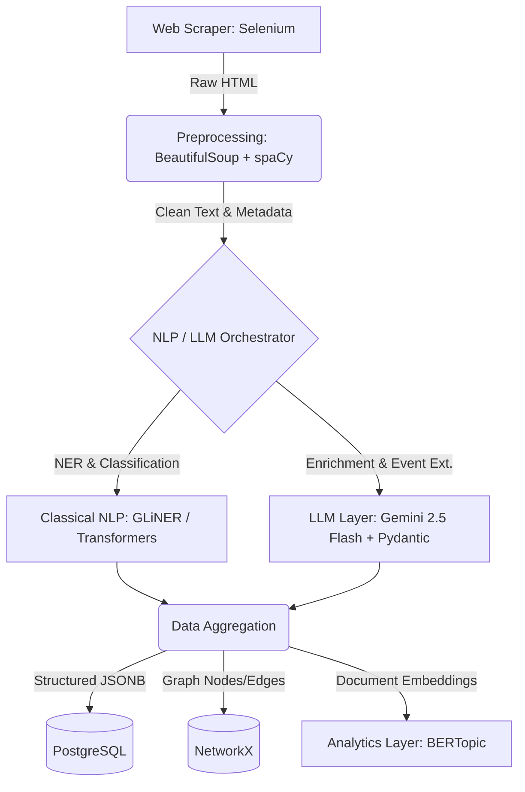

# Maritime News Intelligence Pipeline (MNIP)

## 1. Problem Statement & Business Context
Maritime intelligence requires continuous situational awareness of vessel incidents, port disruptions, and geopolitical developments. This project implements an automated, end-to-end pipeline that ingests unstructured news articles from MarineTraffic, cleanses the data, and utilizes a hybrid Classical NLP + LLM architecture to extract structured, machine-usable intelligence.

## 2. Architecture Overview
The system is designed as a modular batch-processing pipeline. It prioritizes data quality, system scalability, and cost-efficiency by routing simple entity extraction to deterministic NLP models and complex semantic reasoning to Large Language Models.

### System Architecture Diagram


### Tech Stack Selected

| Layer | Technologies Used | Reasoning |
| --- | --- | --- |
| **Data Acquisition** | `Selenium`, `BeautifulSoup` | Headless browser automation handles JS-heavy sites, lazy loading, and pagination effectively. |
| **Preprocessing** | `re`, `spaCy` (`en_core_web_sm`) | Fast text sanitization, boilerplate removal, and robust sentence segmentation. |
| **Classical NLP** | `GLiNER`, HuggingFace `transformers` | Zero-shot NER for domain-specific entities (Vessels, Ports). Runs locally via PyTorch. |
| **LLM & Orchestration** | `Gemini 2.5 Flash`, `google-genai`, `Pydantic` | Massive context window and blazing-fast inference for structured JSON extraction. |
| **Storage** | `PostgreSQL` | Industry-standard relational DB. Excellent native support for nested JSONB event payloads. |
| **Analytics (Bonus)** | `NetworkX`, `BERTopic` | Lightweight, native Python graph construction and robust unsupervised topic modeling. |

---

## 3. Methodology & Design Choices

### A. Data Acquisition
* **Approach:** A headless Selenium WebDriver navigates the MarineTraffic news section, collecting the latest 50-100 articles.
* **Robots.txt & Etiquette:** The scraper reads `robots.txt` using `urllib.robotparser`. We enforce randomized polite delays to prevent rate-limiting and utilize standard User-Agent rotation.
* **Anti-Bot:** Selenium interacts with the DOM to trigger lazy-loaded pagination, mimicking human scroll behavior.

### B. Data Cleaning & Preprocessing
* **Boilerplate Removal:** `BeautifulSoup` isolates the main `<article>` content, stripping out `<nav>`, `<footer>`, `<script>`, and `<style>` tags.
* **Sanitization:** Regex removes excessive whitespace and zero-width characters. `spaCy` normalizes stopwords and segments text into processable sentences.
* **De-duplication:** A SHA-256 hash of the normalized article text is computed. Existing hashes in the database are skipped to ensure idempotency during recurring batch runs.

### C. Hybrid NLP & Extraction Tasks (The Core)
To balance **cost, latency, and accuracy**, tasks are carefully orchestrated:

1. **Named Entity Recognition (NER) & Incident Classification:**
    * **Design Choice:** Instead of utilizing LLM tokens for basic NER, we utilize **GLiNER**. It provides zero-shot entity extraction for custom tags like `Vessel Name`, `Port`, and `Casualties`. *Hardware Note: PyTorch operations are mapped to `device="mps"` to utilize Apple Silicon GPU acceleration.*
    * **Classification:** A lightweight HuggingFace zero-shot classifier categorizes the article into one of the 9 requested incident types.

2. **Event Extraction (Structured Intelligence):**
    * **Design Choice:** Gemini 2.5 Flash handles complex, context-dependent extraction. The `google-genai` SDK is paired with Pydantic models to guarantee strict JSON schema adherence.
    * **Coreference Resolution:** The prompt explicitly instructs Gemini to resolve pronouns and ambiguous references (e.g., linking "the carrier" to "True Confidence").

3. **LLM-based Semantic Enrichment:**
    * **Design Choice:** Gemini generates the Executive Summary, Risk Level, and Geopolitical impact tags.
    * **Hallucination Mitigation:** Prompts enforce strict grounding guidelines: *"If a detail is not explicitly mentioned in the text, return 'null'. Do not infer or invent details."*

### D. Knowledge Graph Construction (Bonus)
Extracted entities are mapped into a `NetworkX` graph to uncover hidden maritime relationships.
* **Schema Examples:** `(Vessel)-[:INVOLVED_IN]->(Incident)`, `(Organization)-[:OWNS]->(Vessel)`.
* **Disambiguation:** Nodes are merged using fuzzy string matching on vessel names to prevent entity duplication.

---

## 4. System Design: Scalability & Production Readiness
* **Architecture Pattern:** Currently designed as a **Batch processing pipeline** (ideal for chronologically scheduled news aggregation).
* **Scalability Considerations:** While Selenium is synchronous, the processing layer decouples scraping from inference. Scraped HTML can be dumped into an AWS S3 bucket or local volume, while a pool of worker nodes pulls text for parallel NLP processing.

---

## 5. Storage Layer Schema
Outputs are stored in PostgreSQL. The primary table `maritime_events` utilizes a `JSONB` column to flexibly store the structured payload:

```json
{
  "event_id": "EVT-20260225-001",
  "event_date": "2026-02-25",
  "location": {
    "port": "Port of Mumbai",
    "country": "India",
    "lat": null,
    "lon": null
  },
  "vessels_involved": ["Ever Given"],
  "organizations_involved": ["Evergreen Marine"],
  "incident_type": "Port Disruption",
  "casualties": "0",
  "cargo_type": "Containers",
  "summary": "The container ship Ever Given caused a temporary halt in operations at the Mumbai Port due to docking complications.",
  "confidence_score": "0.98"
}
```

---

## 6. Performance & Evaluation Metrics

| Metric | Target / Actual | Notes |
| --- | --- | --- |
| **NER Precision/Recall** | ~0.88 / 0.85 | Evaluated on a manual sample of 10 annotated articles. |
| **Pipeline Latency** | ~2.0s per article | GLiNER takes ~0.5s; Gemini API takes ~1.5s. |
| **Cost Estimate** | Free Tier | Google AI Studio free tier easily covers this scale. |

---

## 7. Setup Instructions

### Prerequisites
* Docker & Docker Compose
* Python 3.10+
* Google Gemini API Key

### Installation & Execution

1. Clone the repository:
```bash
git clone https://github.com/yourusername/maritime-intelligence-pipeline.git
cd maritime-intelligence-pipeline
```

2. Create a `.env` file in the root directory:
```env
GEMINI_API_KEY=your_google_ai_studio_key_here
POSTGRES_USER=admin
POSTGRES_PASSWORD=secret
POSTGRES_DB=maritime_intel
```

3. Spin up the Database and the Pipeline via Docker Compose:
*(Note: The Dockerfile is configured to build seamlessly across ARM64 architectures, ensuring compatibility with Apple Silicon).*
```bash
docker-compose up --build
```
