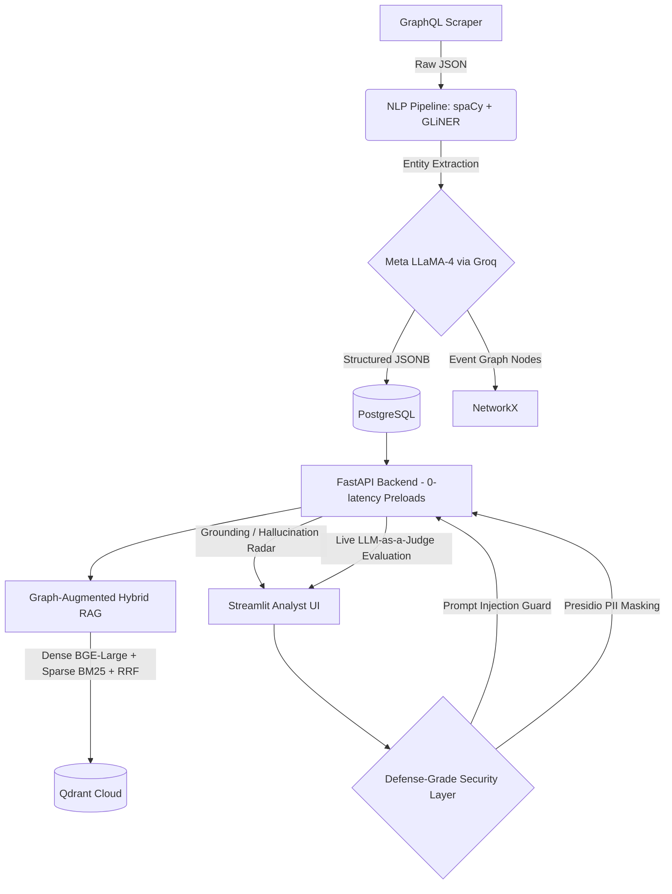

# Maritime News Intelligence Command Center

## 1. Problem Statement & Business Context
Maritime intelligence requires continuous, zero-latency situational awareness of vessel incidents, port disruptions, and geopolitical developments. This project implements an automated, end-to-end intelligence pipeline that ingests unstructured news articles, cleanses the data, utilizes a hybrid Classical NLP + LLM architecture to extract structured intelligence, and surfaces it through a real-time, highly secure, full-stack Dashboard.

## 2. Advanced Architecture Overview
The system is built to production-grade standards, prioritizing extreme inference speeds, explicit hallucination control, and deterministic retrieval. 

### System Architecture Diagram


### Tech Stack Highlights
| Layer | Technologies Used | Key Production Feature |
| --- | --- | --- |
| **Backend API** | `FastAPI`, `uvicorn` | Implements `lifespan` architecture to preload massive embedding models into RAM, ensuring 0-latency cold-starts for the RAG engine. |
| **Web Frontend** | `Streamlit`, Requests | Real-time interactive UI with asynchronous metric loading to separate LLM generation from evaluation processing. |
| **LLM Inference** | `Groq`, `LLaMA-4-17B-instruct` | Utilizes Groq LPUs for blindingly fast generation speeds (800+ tokens/sec) and near-zero cost. |
| **Vector Database** | `Qdrant Cloud` | Implements **Reciprocal Rank Fusion (RRF)** to flawlessly merge Semantic Dense Search with deterministic BM25 Keyword Search. |
| **Security/Gov-Tech**| `Microsoft Presidio` | Instantly masks PII/Gov data in chunks *before* they are sent to the LLM to prevent data bleed. |
| **MLOps Evaluation**| Python Regex, Async loops | Native, dependency-free implementation of the RAG Triad (Context, Faithfulness, Relevance) executing live alongside generation. |

---

## 3. Core Features & Capabilities

### A. Graph-Augmented Hybrid RAG
Standard RAG loses entity relationships. Our ingestion engine (`ingester.py`) queries the PostgreSQL database, extracts the complex `MaritimeEvents` related to the text, and dynamically injects Knowledge Graph tags (e.g., `[Incident: Vessel Sanctions] [Vessel: MV BERTHA]`) directly into the embedding chunk. We then embed this using both `BAAI/bge-large` (Dense) and deterministic MD5-hashing (Sparse) for perfect keyword recall.

### B. The Triple-Layer Assurance Engine (`security.py`)
This project implements production-grade guardrails for safety and factual adherence:
1. **Pre-Flight Filter:** Rejects systemic prompt-injection attempts via heuristic scanning.
2. **Context Masking:** Uses `presidio-analyzer` and `presidio-anonymizer` to detect and scrub PII from Qdrant context chunks before transmission to the Groq LLM.
3. **Post-Flight Grounding Check:** A mathematical overlap analysis that rejects the LLM's final generated answer if it detects entities or facts that do not exist in the retrieved context, preventing hallucinations.

### C. Live Telemetry & "LLM-as-a-Judge" (`evaluator.py`)
No bloat from LangChain or Ragas. A custom backend pipeline automatically spins up a background thread when an analyst asks a question. It intercepts the retrieved context and the generated answer, asks LLaMA-4 to adopt the persona of a strict, impartial judge, and paints an interactive dashboard showing real-time scores for:
*   **Context Relevance** (Did Qdrant fetch the right chunks?)
*   **Faithfulness** (Did the LLM fabricate any details?)
*   **Answer Relevance** (Did the system directly address the analyst?)

---

## 4. Setup Instructions & Execution

### Prerequisites
*   Docker & Docker Compose (for DB isolation)
*   Groq API Key
*   Qdrant Cloud URL & API Key (for Hybrid RRF)

### Installation

1. Clone the repository & set up the environment:
```bash
git clone https://github.com/yourusername/maritime-intelligence-pipeline.git
cd maritime-intelligence-pipeline
pip install -r requirements.txt
```

2. Configure the `.env` file:
```env
# Database Credentials
POSTGRES_USER=admin
POSTGRES_PASSWORD=secret
POSTGRES_DB=maritime_intel

# External APIs
GROQ_API_KEY=gsk_your_key_here
QDRANT_URL=https://your-cluster-url.cloud.qdrant.io
QDRANT_API_KEY=your_qdrant_key
```

### Execution (Fullstack)

1. **Spin up the Database Environment:**
```bash
docker-compose up -d --build
```

2. **Run the Core Pre-computation Pipeline:**
```bash
# Scrapes MarineTraffic, Extracts Entities, Generates Graphs/Topics
python pipeline/main.py

# Ingests PostgreSQL data into Qdrant Cloud via Hybrid Search
python RAG/ingester.py
```

3. **Start the Maritime Command Framework (Two Terminal Windows Required):**

*Terminal 1 (The zero-latency Backend Engine):*
```bash
uvicorn api.main:app --port 8000
```

*Terminal 2 (The Intelligence Analyst Dashboard):*
```bash
streamlit run app.py
```

Navigate to `http://localhost:8501` to access the Intelligence Dashboard!
