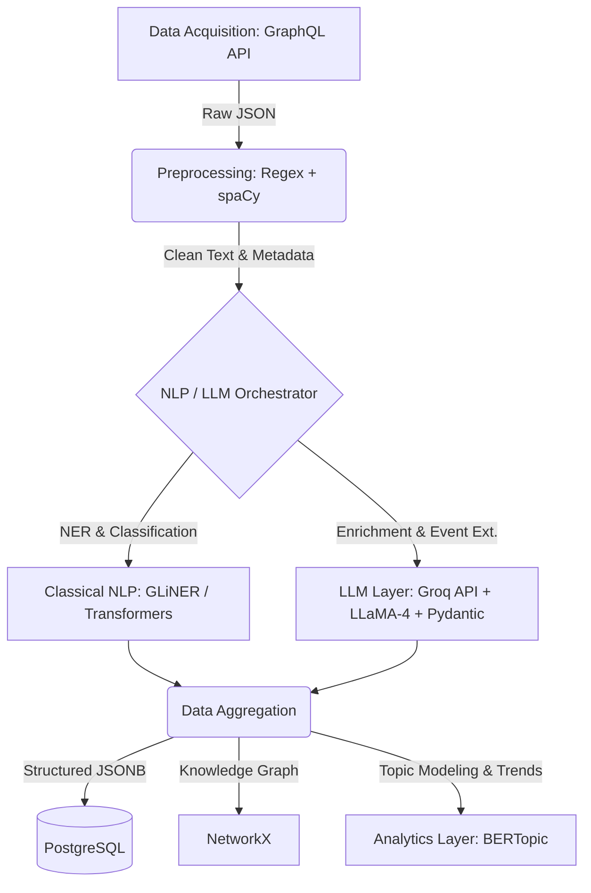

# Maritime News Intelligence Pipeline (MNIP)

## 1. Problem Statement & Business Context
Maritime intelligence requires continuous situational awareness of vessel incidents, port disruptions, and geopolitical developments. This project implements an automated, end-to-end pipeline that ingests unstructured news articles from MarineTraffic, cleanses the data, and utilizes a hybrid Classical NLP + LLM architecture to extract structured, machine-usable intelligence.

## 2. Architecture Overview
The system is designed as a modular batch-processing pipeline. It prioritizes data quality, system scalability, and cost-efficiency by routing simple entity extraction to deterministic NLP models, complex semantic reasoning to Large Language Models (LLMs), and trend analysis to unsupervised machine learning.

### System Architecture Diagram


### Tech Stack Selected

| Layer | Technologies Used | Reasoning |
| --- | --- | --- |
| **Data Acquisition** | `Requests`, `GraphQL API` | Directly queries MarineTraffic's GraphQL backend, providing orders of magnitude faster and cleaner data extraction than traditional Selenium/BeautifulSoup web scraping. |
| **Preprocessing** | `re`, `hashlib`, `spaCy` (`en_core_web_sm`) | Fast text sanitization, markdown removal, deduplication using SHA-256 hashes, and robust sentence segmentation. |
| **Classical NLP** | `GLiNER`, HuggingFace `transformers` | Zero-shot NER for domain-specific entities (Vessels, Ports). A lightweight `facebook/bart-large-mnli` zero-shot classifier categorize incident types locally. |
| **LLM & Orchestration** | `Groq`, `LLaMA-4`, `instructor`, `Pydantic` | Utilizes the blazing-fast inference of Groq LPUs paired with LLaMA-4. `instructor` enforces strict JSON schema adherence through Pydantic models. |
| **Storage** | `PostgreSQL`, `SQLAlchemy` | Industry-standard relational DB. Excellent native support for nested JSON payloads for complex event data. |
| **Analytics & Graphing** | `BERTopic`, `NetworkX`, `matplotlib` | Unsupervised machine learning (`UMAP` + `HDBSCAN`) for emerging threat discovery, and lightweight graph construction to map hidden maritime entity relationships. |
| **Deployment** | `Docker`, `Docker Compose` | Fully containerized environment ensuring seamless cross-platform execution (optimized for CPU to avoid massive GPU dependencies). |

---

## 3. Methodology & Design Choices

### A. Data Acquisition
*   **Approach:** Instead of dealing with fragile HTML DOM parsing, the system acts as a direct client to the MarineTraffic GraphQL API (`news.marinetraffic.com/graphql`).
*   **Benefits:** It bypasses anti-bot measures, lazy loading, and pagination UI issues, allowing us to fetch 100+ articles in pure JSON format in under a second.

### B. Data Cleaning & Preprocessing
*   **Sanitization:** Custom regex removes excessive whitespace and sanitizes markdown. `spaCy` normalizes stopwords to generate an `analytics_text` version of the article optimized for topic modeling.
*   **De-duplication:** A SHA-256 hash of the normalized article text is computed. Existing hashes in the database are instantly skipped to ensure idempotency.

### C. Hybrid NLP & Extraction Tasks (The Core)
To balance **cost, latency, and accuracy**, tasks are carefully orchestrated:

1.  **Named Entity Recognition (NER) & Incident Classification:**
    *   **Design Choice:** Instead of burning LLM tokens for basic NER, we utilize **GLiNER**. It provides zero-shot entity extraction for custom tags like `Vessel Name`, `Port`, and `Organization`.
    *   **Classification:** A lightweight zero-shot classifier (`bart-large-mnli`) categorizes the article into incident types. If the article is purely financial/regulatory with no physical incident entities, the pipeline triggers an **Early Exit**, saving API costs.

2.  **Event Extraction (Structured Intelligence):**
    *   **Design Choice:** The Groq API routes prompts through Meta's `llama-4-scout-17b-16e-instruct` model. The `instructor` library guarantees the LLM returns structured JSON that perfectly matches our defined Pydantic `MaritimeEvent` schema.

3.  **LLM-based Semantic Enrichment:**
    *   **Design Choice:** In the same LLM pass, LLaMA generates an Executive Summary, determines the broader Risk Level, maps the Impact Scope (Local/Global), and flags geopolitical or sanctions-related sensitivities.

### D. Knowledge Graph Construction (Bonus)
The extracted, structured JSON is passed through a `NetworkX` builder script (`graph_builder.py`).
*   Entities like Vessels, Ports, Countries, Organizations, and Incidents form **Nodes**.
*   The script infers multi-hop relationships (e.g., `(Vessel)-[:LOCATED_AT]->(Port)-[:LOCATED_IN]->(Country)`) and draws them as **Edges**.
*   Outputs a dynamic `knowledge_graph.png` visualization.

### E. Topic Modeling & Trend Analysis (Bonus)
The normalized text corpus is fed into an unsupervised ML pipeline (`analytics_engine.py`).
*   **Deep Learning Pipeline:** Converts text into embeddings, reduces dimensionality via `UMAP`, groups clusters using `HDBSCAN`, and extracts theme keywords via `BERTopic`.
*   **Output:** Automatically outputs a `theme_dashboard.html` visualizing the top 5 emerging maritime risks hidden within the corpus.

---

## 4. Storage Layer Schema
Outputs are stored persistently in PostgreSQL. The primary table `maritime_events` utilizes a JSON/Array column structure to flexibly store the nested lists returned by the LLM:

```json
{
  "event_id": "893c834a-9b...",
  "event_date": "2024-02-23",
  "port": "Andernach harbour",
  "country": "Germany",
  "vessels_involved": ["MON DESIR"],
  "organizations_involved": ["Andernach Water Police", "German Red Cross"],
  "incident_type": "Vessel Leak",
  "casualties": "0",
  "cargo_type": "road salt",
  "summary": "The Netherlands-flagged freighter MON DESIR developed leaks during unloading operations.",
  "confidence_score": 1.0
}
```

---

## 5. Setup Instructions & Execution

### Prerequisites
*   Docker & Docker Compose
*   Groq API Key (Free tier easily handles this scale)

### Installation & Execution

1. Clone the repository:
```bash
git clone https://github.com/yourusername/maritime-intelligence-pipeline.git
cd maritime-intelligence-pipeline
```

2. Create a `.env` file in the root directory:
```env
GROQ_API_KEY=your_groq_api_key_here
POSTGRES_USER=admin
POSTGRES_PASSWORD=secret
POSTGRES_DB=maritime_intel
```

3. Spin up the Database and the Pipeline via Docker Compose:
```bash
docker-compose up --build
```
*Note: Our optimized Dockerfile locally caches Heavy ML models (spaCy, HuggingFace, GLiNER) on build to ensure rapid boot times.*

4. To generate the Bonus Visualizations (Graph & Topic Models) locally:
```bash
# Ensure you have a python virtual environment active
pip install -r requirements.txt

# Generate the Knowledge Graph (.png)
python pipeline/graph_builder.py

# Generate the Topic Modeling Dashboard (.html)
python pipeline/analytics_engine.py
```
